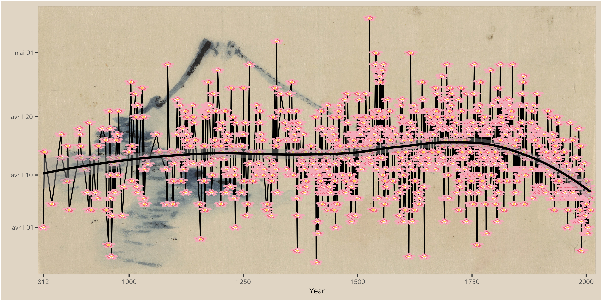

I enjoyed the cherry blossom tree plot by Robin Rohwer (@RobinRohwer) a lot and decided to use her code to recreate her plot on Twitter https://twitter.com/RobinRohwer/status/1639097356657512449. The code was only shared in an image, so I used some OCR software to read the code and correct any OCR errors with the help of ChatGPT. Also used ChatGPT to comment on the code and use the Pacman R library to substitute multiple require() calls and finally save the plot to file. The font of the plot was not really my cup of tea, so I decided to use "M Plus 1p" instead (https://fonts.google.com/specimen/M+PLUS+1p). Took the liberty to change the plot's background to a color closer
to the background image.

The cherry blossom tree time data is automatically being downloaded in the R script from https://www.ncei.noaa.gov/pub/data/paleo/historical/phenology/japan/KyotoFullFlowerW.xls and saved to this folder.

The Python script was created with the ggplot2-copy of Python, Plotnine, and is still work in progress. Appreciate pull requests that bring this plot to the next level.

The background image called "A person in a small boat on a river with Mount Fuji" was painted by Japanese ukiyo-e artist of the Edo period Katsushika Hokusai. I downloaded it from Wikipedia Commons https://commons.wikimedia.org wikiFile:A_person_in_a_small_boat_on_a_river_with_Mount_Fuji_in_the_background_LCCN2009631925.jpg. I cropped and mirrored the upper part of the image as per instruction by Robin Rohwer. Check out Katsushika Hokusai's work, its really beautiful.

Install innstructions:

R users: Simply run the R script.

Python users: Create virtual environment and install dependcies with requirements.txt. Run Python script. 

All credits for the R code go to Robin Rohwer (@RobinRohwer). You're free to use my Python code hower you like.

Credits:

Data
Yasuyuki Aono, Shizuka Saito. 2010. Clarifying springtime temperature reconstructions of the medieval period by gap-filling the cherry blossom phenological data series at Kyoto, Japan. International Journal of Biometeorology, 54(2), 211-219. doi: 10.1007/s00484-009-0272-x
https://www.ncei.noaa.gov/access/paleo-search/study/26430?siteId=57850

Image
https://commons.wikimedia.org/wiki/File:A_person_in_a_small_boat_on_a_river_with_Mount_Fuji_in_the_background_LCCN2009631925.jpg
